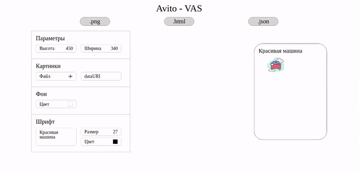

# Avito - Vas

Avito - Vas is a web application for construction banners.
## Example
 
## Installation

**1. Download the project**

```bash
git clone https://github.com/Dmitriymgtu/Avito-vas.git
```
**2. Go to the application folder**

```bash
cd Avito-vas
```
**3. Run application**

```bash
npm start
```
Technologies used: ```React```, ```Typescript```, ```styled-components```.

